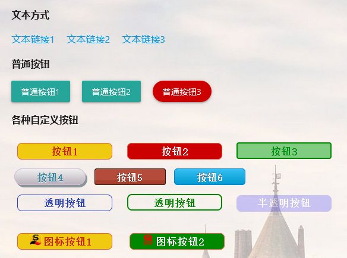
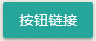
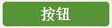
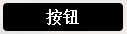

# ⛵随心远航系统说明

**项目已切换到** [⛵²webnav2](https://github.com/shaoziyang/webnav2)


[⛵随心远航](https://github.com/shaoziyang/webnav)是一个可以 DIY 的开源个人网址导航系统，它基于开源的 markdown [WikiDocs](https://github.com/Zavy86/wikidocs)系统，小巧快速，使用方便，维护简单，无需数据库。


## 特点

- 完全开源，基于开源的 [WikiDocs](https://github.com/Zavy86/wikidocs)
	- 无需注册，没有会员和充值，没有功能限制
	- 没有广告，不收集个人信息，数据完全在本地
- 使用简单，无需数据库，维护方便
- 体积小，速度快，占用资源少，界面干净清爽
- 自由度高，可以灵活定制和扩展功能，限制你的只有想象力
	- 熟悉html、js、css，可以随心修改，自由定制各种功能
	- 如果不熟悉也没关系，按照说明以及模板修改，足以满足大部分需求
	- 带有简单的导航统计（打开网址和搜索次数）
	- 可以自定义背景图片，可以定时更换背景
	- 可以查看和下载必应每日一图到背景图库
	- 可以修改导航链接样式、大小、颜色
	- 每个页面都可以独立加入js特效、css样式
	- ……
- 自带markdown编辑器和历史版本管理
- 适配手机平板浏览器
- 支持多级目录（分类），自动生成链接
- 自带内容搜索功能，支持中文搜索
- 除了网址导航，还可以作为
	- 家庭nas的访问入口
	- 个人博客、CMS、小型知识库（原本就是 wiki 系统）
	- 个人在线书库和文档管理系统
	- 放在💾U盘/移动硬盘作为 windows 便携软件
	- 安装到📱安卓手机，变为随身服务器
	- 融合 p5js、js小游戏等
- ⛵ ……

## 安装说明

### 环境要求

系统需要的资源非常低，安装也很简单，基本需求是：

- apache2/nginx 服务器，开启 rewrite 功能
- php 7.4 以上版本

系统已经在多个不同的 Linux（包括armbian）、安卓、windows 软硬件环境中进行了测试。

### 下载

程序可以在 github 或者 gitee 上下载：

* [github](https://github.com/shaoziyang/webnav)
* [gitee](https://gitee.com/shaoziyang/webnav)

### 安装

将下载的文件解压缩，将其中的`nav`目录到服务器的某一目录或子目录，打开浏览器，进行基本配置，设置标题、编辑密码等参数就可以使用了。


### 系统维护

基本不需要特别维护，定期备份一下个人添加的图片（`images目录`），以及编写的网址文件（`datasets/documents`目录），就可以了。


## 使用说明

### 模板说明

随心远航目前自带的网址并不多，只提供了数十个网址和本地搜索作为模板给大家参考，大家可以根据自己情况逐步添加完善，制作出最适合自己的网址导航系统。如果大家将自己整理的一些专业网址模块和脚本都分享出来，说不定以后也可以出一个懒人版网址导航。

目前系统提供了两个模板：网址模板和搜索模板。

- 网址模板包含数十个各种样式的网址链接。如果对html/css熟悉，可以随心修改；如果不熟或者不想太麻烦，可以直接在模板文件基础上，复制粘贴就可以了。
- 搜索模板包含十多个常用搜索引擎，可以直接从本地开始搜索。

### 添加分类和页面

点击右上角的<font color=green><b>+</b>加号</font>按钮，可以添加页面（分类），添加后自动创建文件（文件名是content.md），编辑文件后保存就会显示在左侧的导航菜单栏。可以将不同类型的网站分类，放在不同导航页面，这样既方便访问，也容易维护。

每个页面下还可以创建多级目录，如：`分类1/1级子目录/2级子目录`，可以一次创建多级目录。目录级数没有限制，但是左侧只显示前3级，更多子目录会附加到相应页面最后，作为链接显示出来。如果页面内容中有一级标题（`# XXX`），它将作为菜单中的导航链接名，如果没有一级标题，就使用文件名。

默认的页面是 homepage（也就是 homepage 目录），它相当于主页面，它本身和它下面的子目录是不会显示到左侧的分类栏。可以把最常用的链接放在 homepage 中，点击左上角的标题栏就会显示 homepage 内容。

#### 编辑页面

每个页面可以用 **markdown** 语法编写任意内容，可以同时混合 html 语法。编辑页面可以使用内置的 markdown 编辑器，也可以用外部编辑器编辑。使用内部编辑器时，会自动保存历史存档。

也可以用其它方式创建目录和文件（文件名必须是 content.md），系统会自动识别新增加的目录和文件。

### 添加链接

作为网址导航，最重要的就是添加各种网址和网址管理。

<b>随心远航</b>系统没有独立的网址管理界面，需要通过手工方式编写网址。虽然稍显复杂，但是也带来了最大的灵活性，可以随意设置链接的样式、大小、分类、外观、边框、间距、颜色、透明度、渐变等等，各种不同样式可以混合显示，能想出来的功能基本都能实现，限制你的只有想象力。其它一些带有管理界面的系统，网址也需要一个个添加和维护，网址多了一样也麻烦。手工方式看起来麻烦，但是大部分时候也就是复制和粘贴，其实用起来没有那么难。

先看几种不同样式的链接



[文本链接]()，是最简单的方式，使用下面定义：

```
<a target="_blank" href="网址">说明</a>
```

- `target="_blank"` 代表在新的浏览器窗口打开链接
- `href="网址"` 处将网址替换为需要的地址，如 https://github.com
- `说明` 是链接的说明，可以是任何文字



使用系统默认定义的按钮类 

```
<a class="btn" target="_blank" href="网址">说明</a>
```

- class="btn" ，代表这是一个按钮，其它和文本链接一样。
- 可以用 style 参数修改按钮属性，方法参考下面说明。


自定义按钮，先在css中定义一个类别，然后使用它设置链接。基本用法是先定义一个基本class类，再到链接中单独设置不同属性（如颜色）。下面使用的sxyhButton_02已经在styles/styles-custom.css中定义了（大家也可以将更多自定义的样式添加到这个文件中），功能从名称就可以看出，这里就不做详细介绍了。需要深入了解时可以到网上搜索一下。

```
.sxyhButton_02 {
    background-color:#579438;
    border-radius:4px;
    border:1px solid #4b8f29;;
    display:inline-block;
    cursor:pointer;
    color:#ffffff;
    font-family:宋体;
    font-size:16px;
    font-weight:bold;
    text-decoration:none;
    text-align: center;
    margin: 5px;
    width: 120px; 
    height: 28px;
    line-height: 28px;
}
.sxyhButton_02:hover {
    background-color:#579438;
}
.sxyhButton_02:active {
    position:relative;
    top:1px;
}
```

直接使用，就可以显示默认的效果



如果需要修改某一属性，单独在链接里的 style 属性中修改，如设置按钮颜色是黑底白字：`<a class="sxyhButton_02" style="background-color:#000000;color:#ffffff">按钮</a>`，效果是



带图标按钮，就是给同时显示一个图片文件，并调整到合适位置。图片需要先准备好，也可以动态从网上获取，比如获取网站的favicon.ico文件，这样虽然不用保存文件，但是会降低打开的速度。
```
<a class="sxyhButton_01" style="padding-right: 30px;" target="_blank" href="">图标按钮</a>
<a class="sxyhButton_01" style="padding-right: 30px;background-color:#ffffff;color:#000000" target="_blank" href="">淘宝图标</a>
```


**提示**

- 每行只写一个链接
	- 如果是文字链接，可以在链接的最后放一个空格符，分隔两个链接
	- 按钮链接，可以通过设置按钮的外边距margin，同时让按钮都是相同宽度，让按钮排列更加美观。
- 编辑时的单个换行不会影响显示，需要强制换行显示时用多个换行或者用 `<br>`
- 使用图标按钮时，可能需要通过 `padding-top padding-right` 属性调整图标和文字到合适位置
- 将公共属性放到样式表（css），独立属性在链接的 style 中设置
- 一个导航页面不要放过多链接，可以分类存放，或者将常用链接放在一级目录，不常用的可以放在二级目录中


更多说明和效果展示，请参考系统的模板和在线演示。


### 设置背景图片

系统默认每天随机更换一次背景图片，背景图片存放在<b><font color=BLUE>随心导航</font></b>目录下的 `images` 文件夹中。可以将任意 jpg、png、webp 图形文件复制到 `images` 文件夹中，不需要特别命名或设置，系统会自动定时随机进行更换。

#### 查看背景图库

点击页面底部右下角的背景图库图标，就可以查看系统中已有的图片。

#### 改变更新频率

背景图库浏览的上方，显示了背景自动更换的周期（秒），以及下次更新时间的倒计时。如果希望使用不同的更新周期，在输入框中设置新的时间，然后按下<b>设置新时间</b>按钮。0代表禁止自动更新，但是可以手动更新。

#### 取消背景图片

点击<b>取消背景图像</b>按钮，就可以取消背景图，同时也会禁用自动更新功能。

#### 手工更新背景

浏览背景图库时，点击图片，就可以查看图片的大图。点击图片下方的设置<b>设置为系统背景</b>按钮，就可以指定这个图像为系统背景图。返回主界面后如果没有生效，是因为浏览器缓存造成的，这时清理浏览器缓存，或者按下 Ctrl-F5键，就可以显示出新的背景图像了。

####改变指定页面背景

上面的自动更换背景是针对所有页面的。如果希望指定特定页面的背景，可以编辑页面文件，在文件的最后加上下面代码（注意 `<style>` 前面不能有空格）。

```
<style>
body {
  background-image: url(目录/图片文件名);
  background-repeat: no-repeat;
  background-size: cover;
  background-attachment: fixed;
}
</style>
```

图片可以是网络文件，也可以是本地文件。如果文件在导航系统目录下，可以用相对目录，如 `background-image: url(../../../images/bg17.jpg);` （不同目录下文件的相对位置不同，请根据具体目录设置，本文件所在位置是 `homepage/帮助/设置背景图片`，因此相对目录是`../../../`）。


```
<style>
body {
  background-image: url(../../../images/bg17.jpg);
  background-repeat: no-repeat;
  background-size: cover;
  background-attachment: fixed;

</style>}
```


#### 用必应每日一图自动更换背景

将这段代码放在页面的最后，就可以让指定页面使用必应每日一图作为背景，每天自动更换。它自动获取必应每日一图的当日图片，并在它上面叠加一个png图片做蒙版，避免因为图片颜色过于鲜艳而看不清文字。

```
<script>document.write('<style>body{  background-image: url('+navurl+'scripts/backmask.png), url('+navurl+'scripts/bingwallpaperurl.php);  background-repeat: no-repeat;  background-size: cover;  background-attachment: fixed;}<\/style>');</script>
```

使用脚本方式是为了自动适应目录，避免不同的子目录或导航系统目录名造成路径的变化使脚本地址错误。如果目录固定不变，也可以直接指定地址，如（假定导航系统目录是 `'/nav/'`）：

```
<style>
	body{
		background-image: url(/nav/scripts/backmask.png), url(/nav/scripts/bingwallpaperurl.php);
		background-repeat: no-repeat;
		background-size: cover;
		background-attachment: fixed;
	}
</style>
```


使用其它图片源也可以用类似方法，将第二个url中的网址替换为图片源网址。

### 设置页面特效

每个页面都可以单独设置 javascript 特效。可以从网上搜索一些合适的 js 特效代码（如飘雪、小星星、爱心、下雨等等），粘贴到页面的最后，保存后自动生效。实际效果可以查看系统的在线演示。

